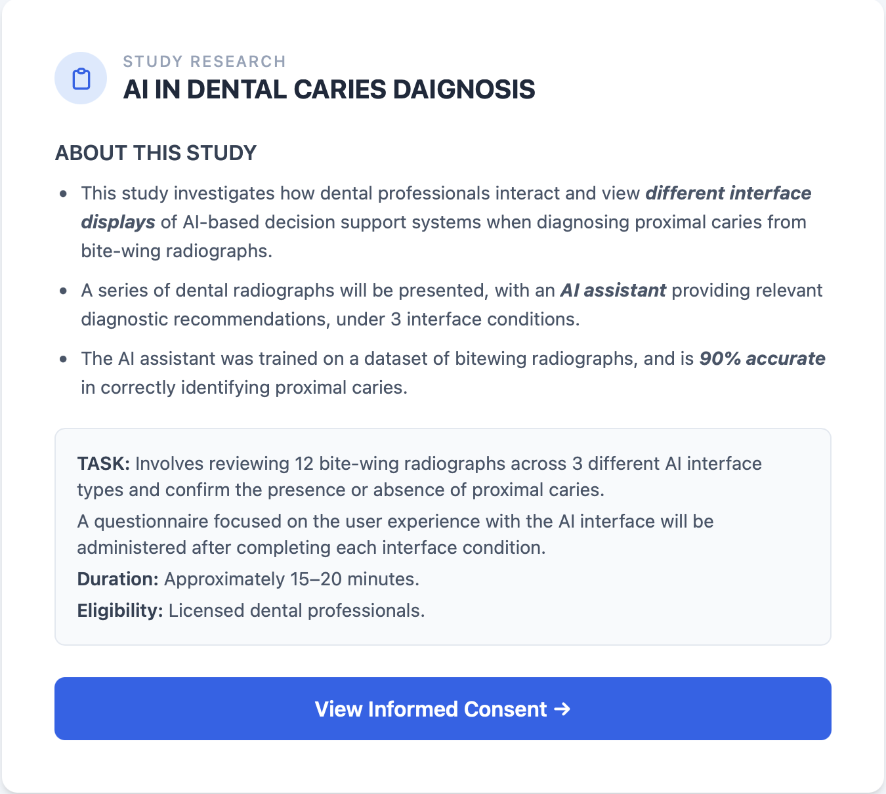
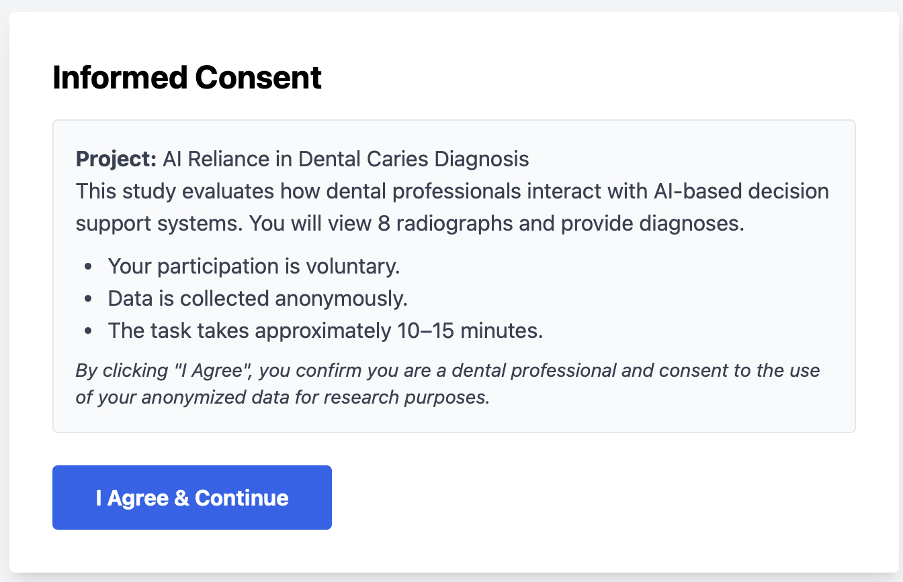
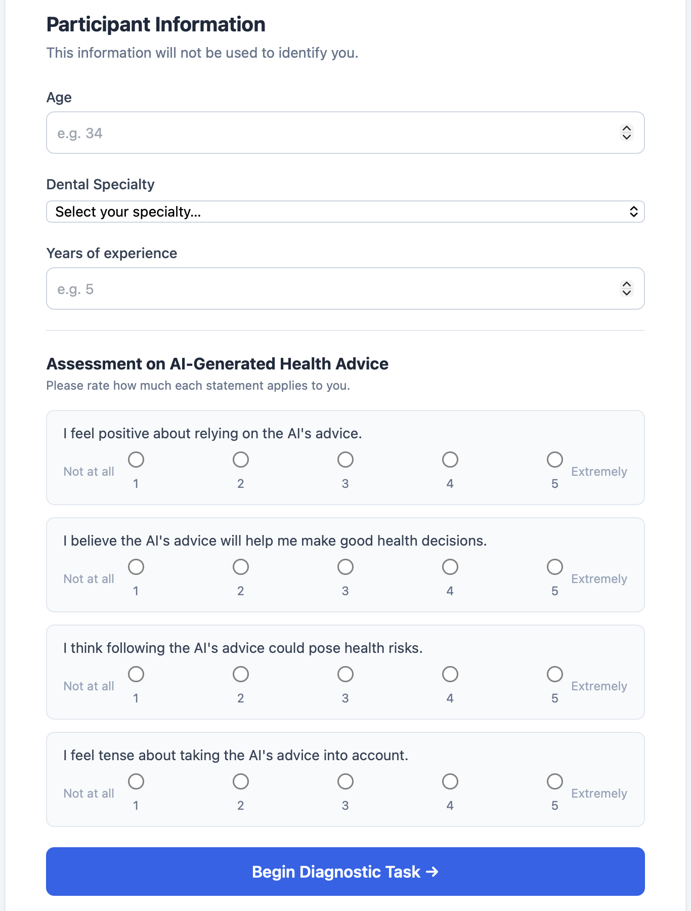
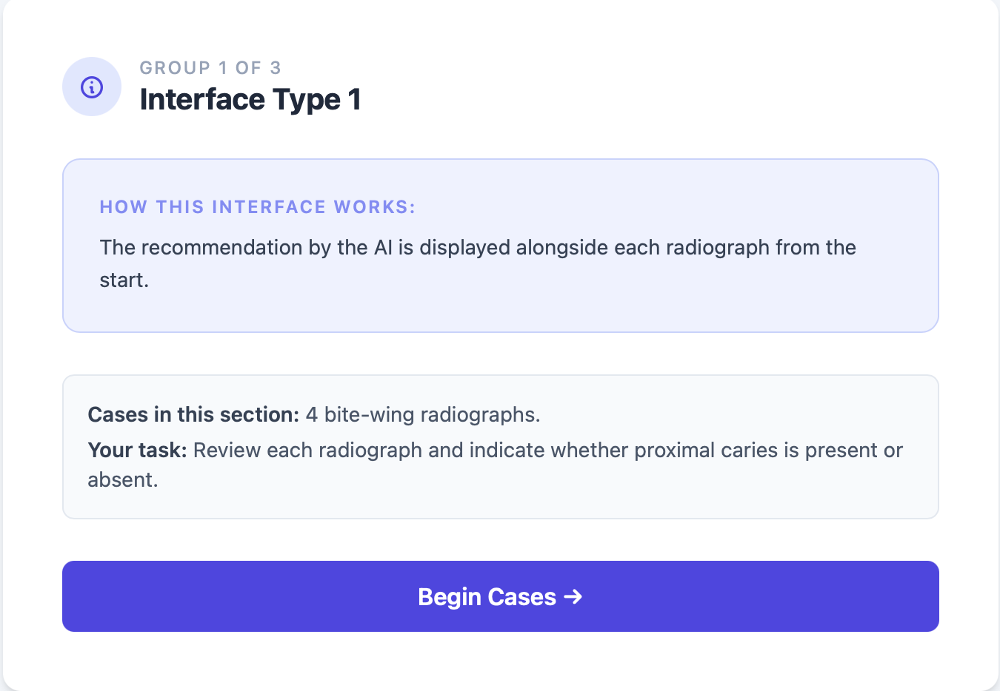
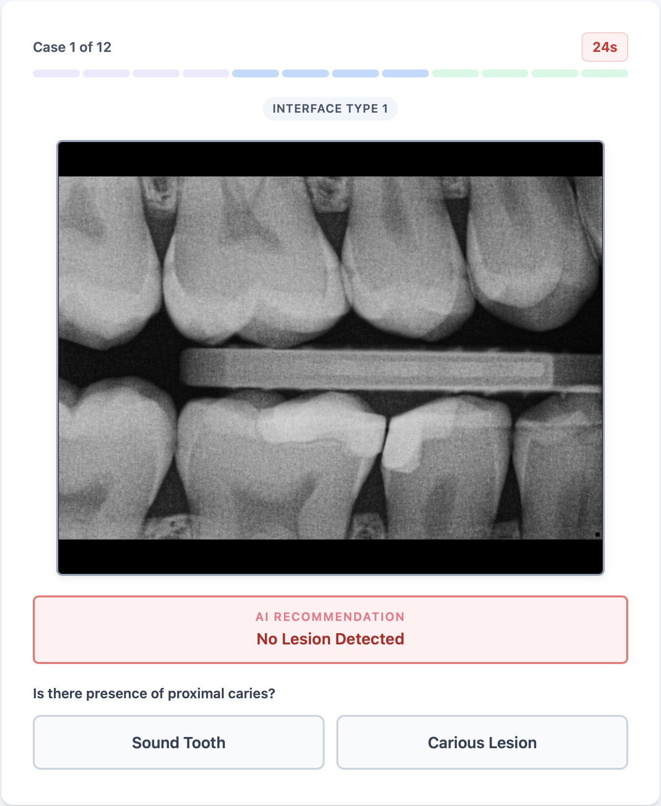
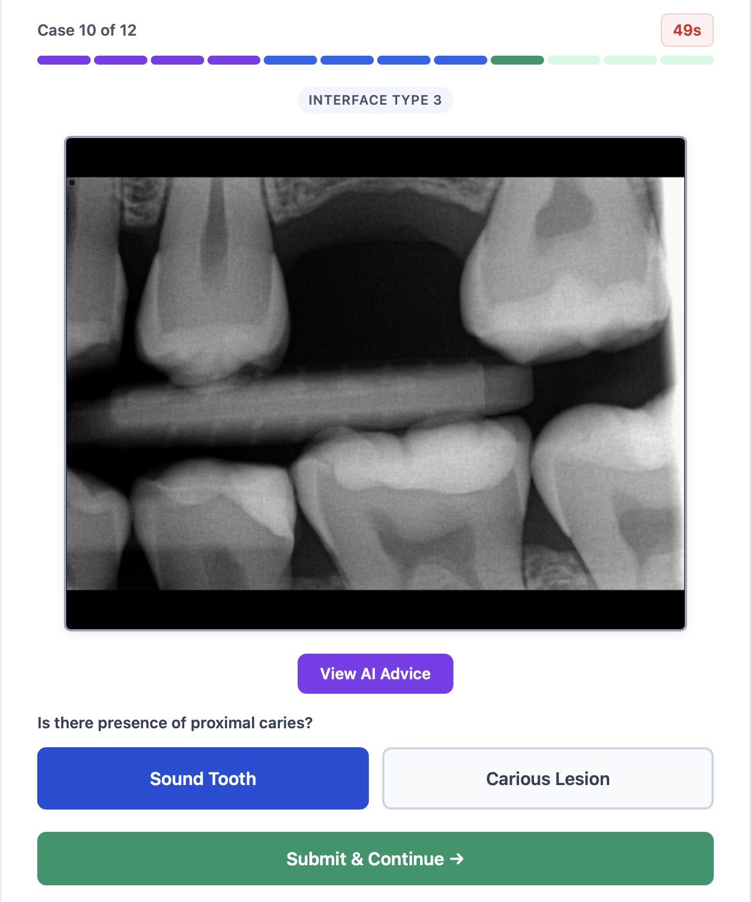
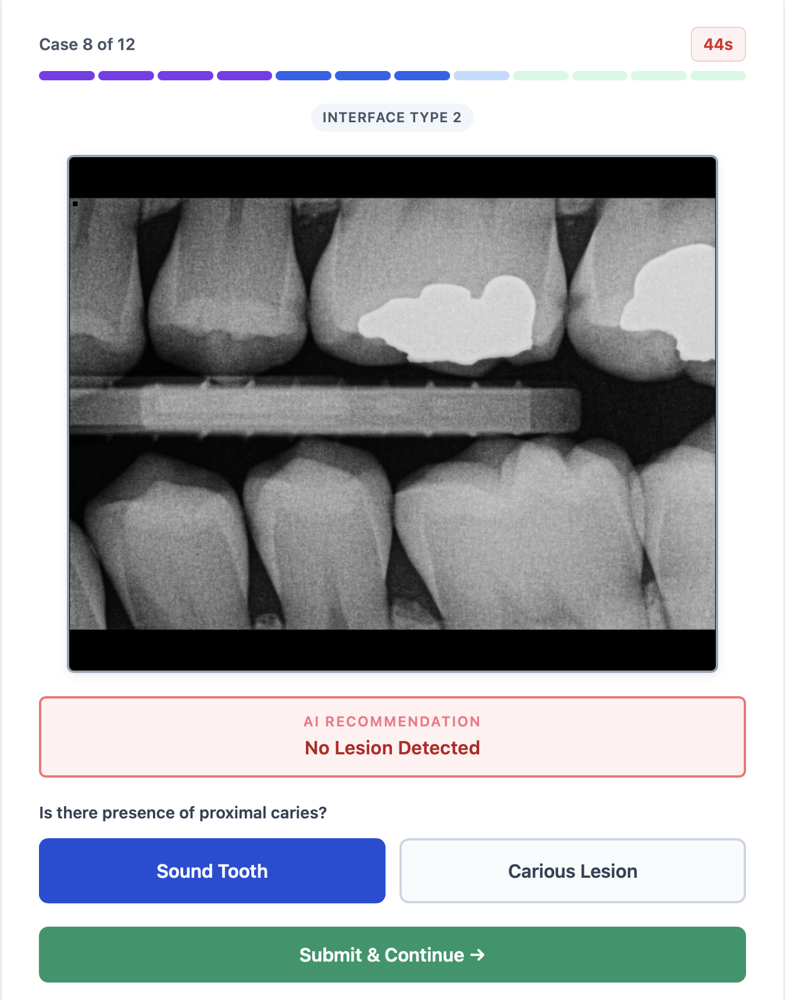
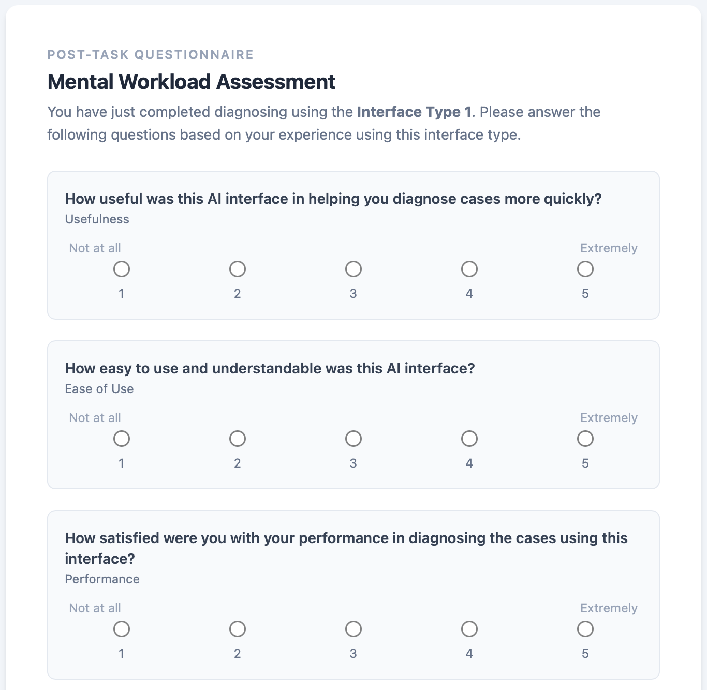
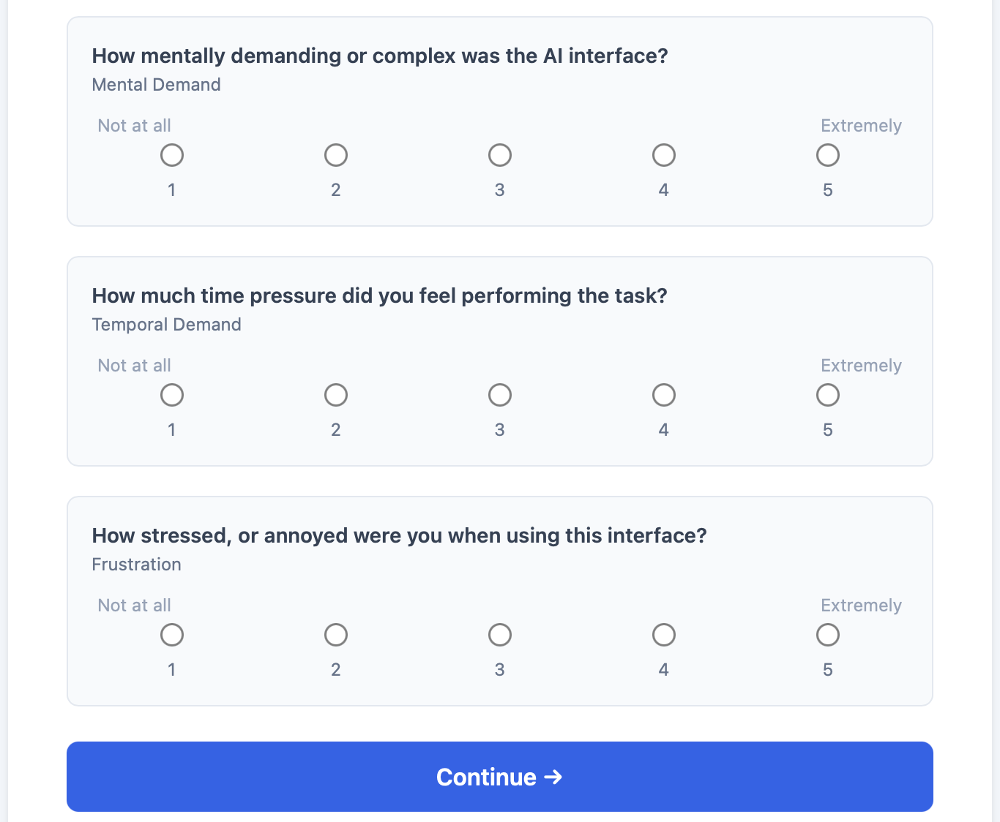
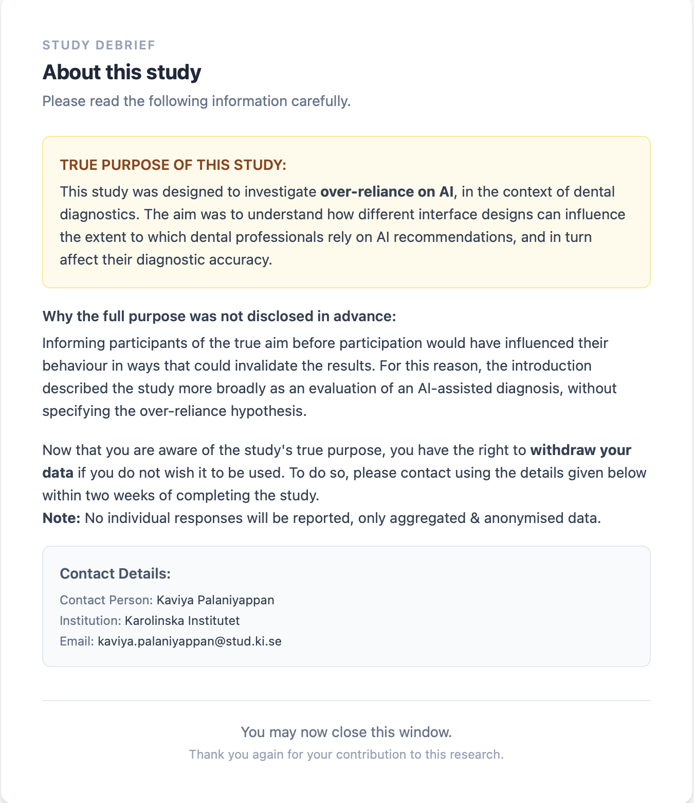

# AI-Assisted CDSS Evaluation Tool: Overcoming Automation Bias

This interactive online experimental data collection survey was developed for a Master's Thesis project at **Karolinska Institutet** to evaluate Cognitive Forcing Functions (CFFs) in Artificial Intelligence-assisted Clinical Decision Support Systems (AI-CDSS) within dentistry. 

The tool simulates a professional dental workflow where licensed dental practitioners diagnose proximal caries from a series of 12 bite-wing radiographs. It is designed to capture, measure, and analyze clinician over-reliance on AI recommendations (automation bias) across different interface conditions.

---

## Tool Interface

### 1. Project Introduction (`#screen-intro`)
The landing portal introducing the scope of the study. It discloses that the embedded AI assistant is 90% accurate in identifying proximal caries on bitewing radiographs and establishes task scope and criteria.


*Figure 1: Study objectives and task overview.*

### 2. Informed Consent (`#screen-consent`)
Outlines regulatory and ethical bounds in compliance with the Declaration of Helsinki and GDPR, ensuring voluntary participation and complete tracking anonymity.


*Figure 2: Digital informed consent verification gateway.*

### 3. Participant Demographics & Baseline Trust (`#screen-pre`)
Gathers demographic metrics (Age, Experience, Specialty) alongside an integrated 4-question psychometric baseline survey measuring prior cognitive affinity toward computer-aided health advice:
*   **Trust Evaluation Scale (TAIS):** Quantifies prospective positive reliance on automated diagnostics.
*   **Distrust Evaluation Scale (DTAIS):** Assesses user-perceived systemic risks and cognitive tension.


*Figure 3: Practitioner profiling and baseline trust metric scale inputs.*

### 4. Blinded Interface Condition Introductions (`#screen-interface-intro`)
An intentional structural buffer presented before each block of 4 cases. To counter observation bias, internal test conditions are mapped to dynamic user-facing labels (`Interface Type 1`, `Interface Type 2`, `Interface Type 3`) based on their randomized Latin Square sequence.


*Figure 4: Interface workflow transition explaining upcoming interaction rules.*

### 5. Active Diagnostic Task Loop (`#screen-task`)
The core diagnostic interface displaying bite-wing radiographs alongside an interactive 12-segment multi-colored progress bar mapped to the user's current track. It handles the 3 interface conditions:
*   **Immediate Condition:** AI advice overlay is visible instantly.
*   **Optional Condition:** AI recommendations are hidden behind a manual click trigger.
*   **Staged Condition:** Forces a double-entry workflow where an initial diagnosis must be input to reveal the hidden AI recommendation, allowing for mid-trial diagnostic revision.


*Figure 5: Radiograph presentation, persistent countdown timers, and diagnosis selectors.*


*Figure 6: Radiograph presentation, persistent countdown timers, and diagnosis selectors.*


*Figure 7: Radiograph presentation, persistent countdown timers, and diagnosis selectors.*

### 6. Mental Workload Assessment (`#screen-tlx`)
Administered instantly at the tail-end of each interface condition block. It leverages a modified subjective raw NASA-TLX survey evaluating 6 key dimensions on a 1–5 scale: *Usefulness, Ease of Use, Performance, Mental Demand, Temporal Demand, and Frustration*.


*Figure 8: Post-task subjective cognitive friction assessment matrix.*


*Figure 9: Post-task subjective cognitive friction assessment matrix.*

### 7. Submission Confirmation & Ethical Debrief (`#screen-submitted` & `#screen-debrief`)
The final data transition window confirming anonymous packet transfer, followed by an explicit ethical debrief revealing the concealment mechanism (the fact that 50% of the AI suggestions were intentionally erroneous to track automation bias) along with formal institution contact avenues.


*Figure 10: Data submission success and full research disclosure window.*

---

## Data Model & Metric Logging

The schema transmitted downstream to the database endpoint structures transactional research indicators into an anonymous single object array:

```json
{
  "pre": {
    "age": "34",
    "specialty": "Speciality Dentist",
    "specialistType": "Endodontist",
    "experience": "8",
    "trust": { "tais1": "4", "tais2": "4" },
    "distrust": { "dtais1": "2", "dtais2": "1" }
  },
  "groupOrder": ["Optional", "Staged", "Immediate"],
  "trials": [
    {
      "interface": "Optional",
      "type": "Incorrect",
      "groundTruth": "Sound",
      "aiText": "Carious Lesion Detected",
      "initialDiagnosis": "Sound",
      "initialTime": 4.821,
      "finalDiagnosis": "Caries",
      "timeToChange": 2.114,
      "isCorrect": false
    }
  ],
  "tlx": {
    "Optional": {
      "Usefulness": "3",
      "Ease of Use": "4",
      "Performance": "4",
      "Mental Demand": "2",
      "Temporal Demand": "1",
      "Frustration": "1"
    }
  }
}
